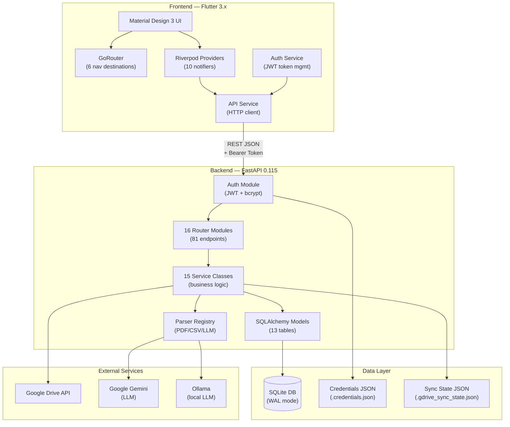
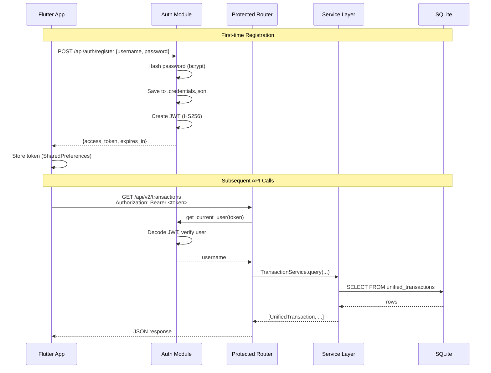
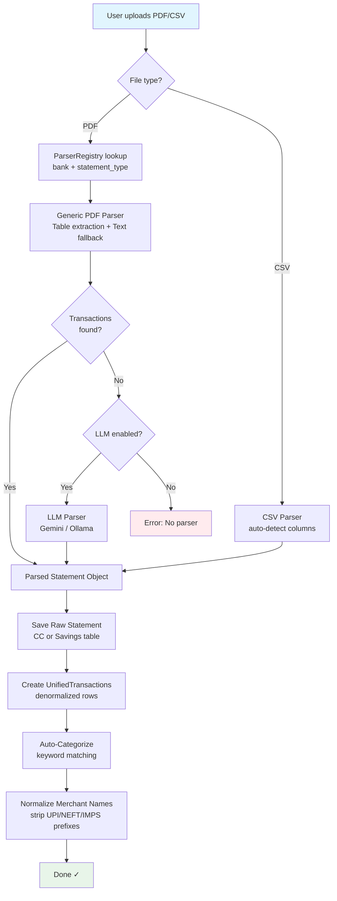
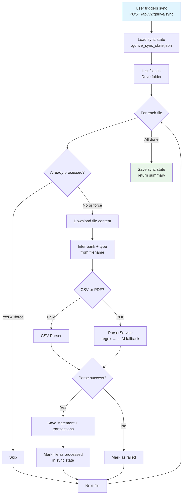
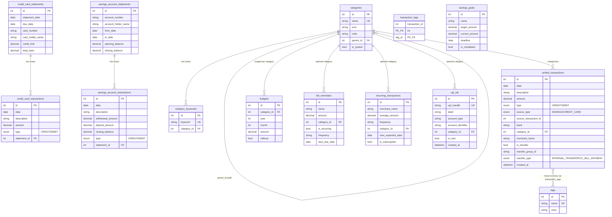
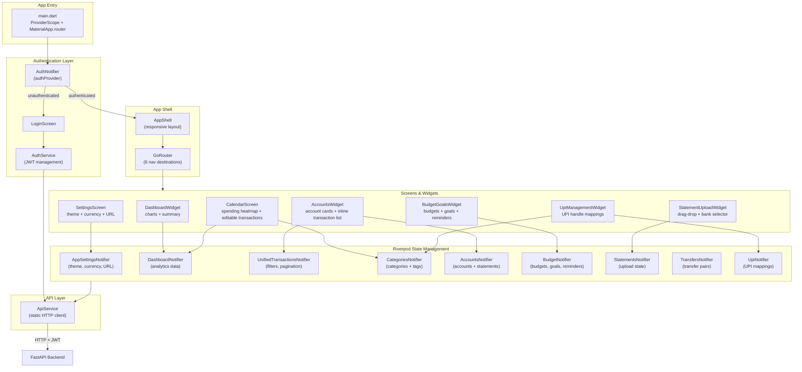
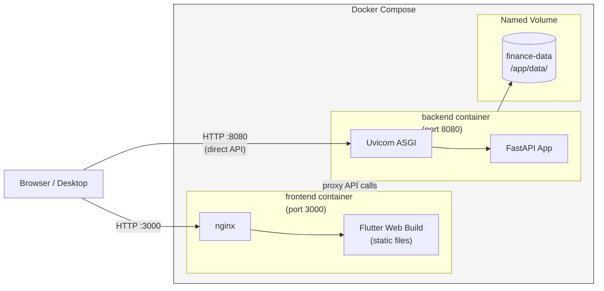
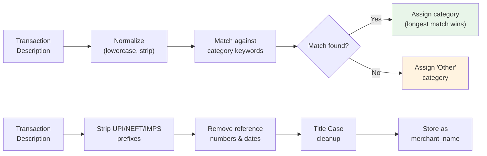
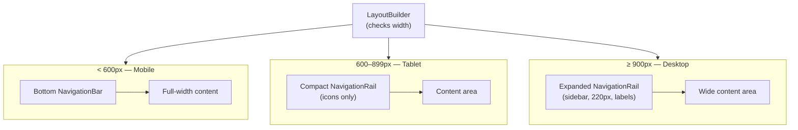

# Finance Tracker v2 — Architecture Diagrams

Visual architecture reference for the full-stack application.

---

## 1. High-Level System Architecture

---

## 2. Backend Layered Architecture

```mermaid
graph TB
    subgraph Presentation["Router Layer (API)"]
        direction LR
        R1["health.py"]
        R2["auth (auth.py)"]
        R3["upload.py"]
        R4["unified_transactions.py"]
        R5["categories.py"]
        R6["tags.py"]
        R7["analytics.py"]
        R8["accounts.py"]
        R9["budgets.py"]
        R10["goals.py"]
        R11["reminders.py"]
        R12["export.py"]
        R13["gdrive.py"]
        R14["transfers.py"]
        R15["upi.py"]
        R16["transactions.py<br/>(legacy)"]
    end

    subgraph Business["Service Layer"]
        direction LR
        S1["ParserService"]
        S2["TransactionService"]
        S3["CategoryService"]
        S4["CategorizationService"]
        S5["AnalyticsService"]
        S6["AccountsService"]
        S7["BudgetService"]
        S8["GoalsService"]
        S9["BillReminderService"]
        S10["RecurringService"]
        S11["GDriveSyncService"]
        S12["CreditCardService"]
        S13["SavingsService"]
        S14["TransferDetectionService"]
        S15["UpiService"]
    end

    subgraph Data["Model Layer"]
        direction LR
        M1["UnifiedTransaction"]
        M2["Category / CategoryKeyword"]
        M3["Tag / TransactionTag"]
        M4["Budget"]
        M5["SavingsGoal"]
        M6["BillReminder"]
        M7["RecurringTransaction"]
        M8["CreditCardStatement<br/>CreditCardTransaction"]
        M9["SavingsAccountStatement<br/>SavingsAccountTransaction"]
        M10["UpiId"]
    end

    Presentation --> Business
    Business --> Data
```

---

## 3. Request Flow (Authentication)

---

## 4. Statement Upload & Processing Pipeline

---

## 5. Google Drive Sync Flow

---

## 6. Database Entity Relationship Diagram

---

## 7. Frontend Widget & Provider Architecture

---

## 8. Deployment Architecture (Docker)

---

## 9. Auto-Categorization Pipeline

---

## 10. Navigation & Responsive Layout

