# Finance Tracker — User Flows & API Reference

All identified user flows with their corresponding API endpoints.

---

## 1. Statement Parsing & Import Flow

**Overview:** Upload a bank statement (PDF or CSV) or sync a local directory, parse it into generic DTOs, resolve the target Bank Account, and save the transaction list into the unified database.

#### Knowledge Graph Trace

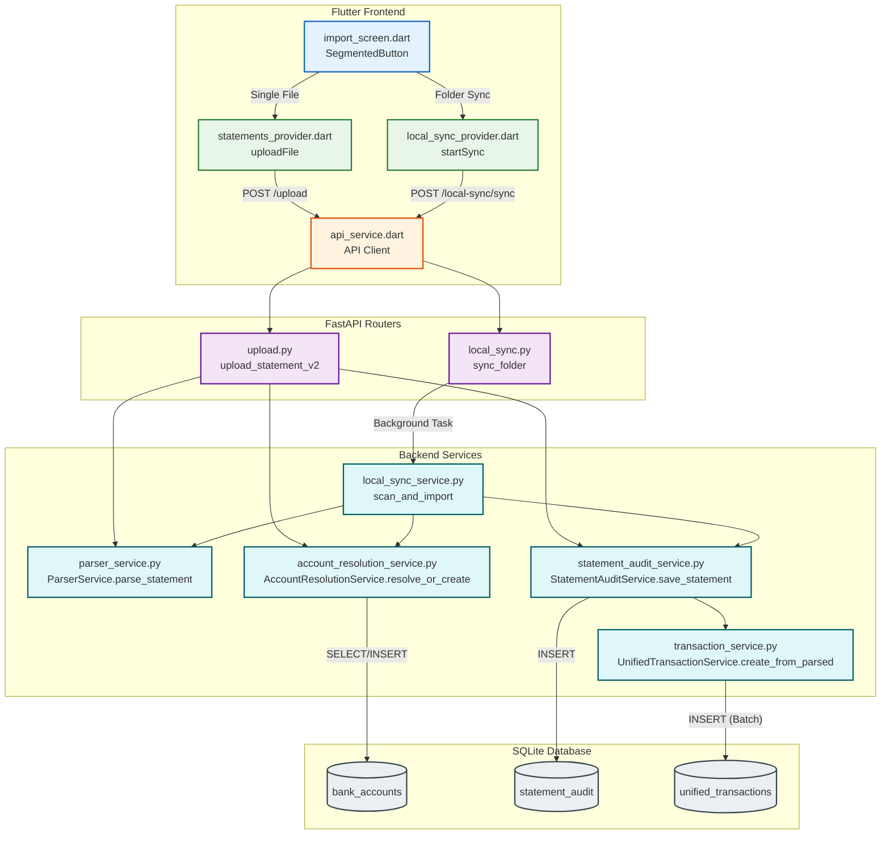

---

## 2. Transaction Parsing & Categorization Flow

**Overview:** The core logic executed during an import to intelligently assign categories. It runs a waterfall of native heuristics (UPI, MCC, Regex) followed by user-defined custom Rules.

#### Knowledge Graph Trace

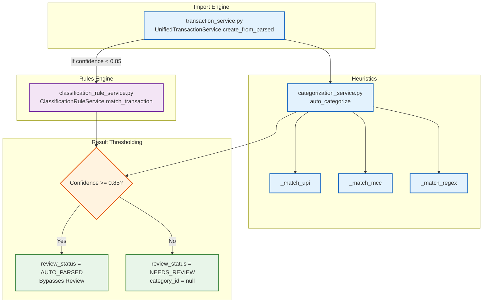

---

## 3. Review & Classification Rules Flow

**Overview:** How users manually review low-confidence transactions and create global rules to automatically categorize them retroactively and in the future.

#### Knowledge Graph Trace

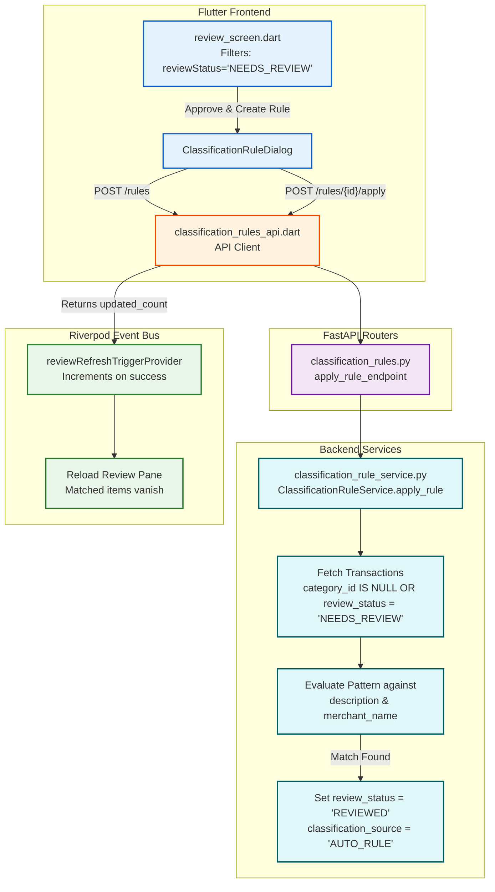

---

## 4. Transaction Browsing & Calendar Flow

**Overview:** How transactions are fetched, filtered, viewed on the calendar, and manually edited or deleted by the user across the app.

#### Knowledge Graph Trace

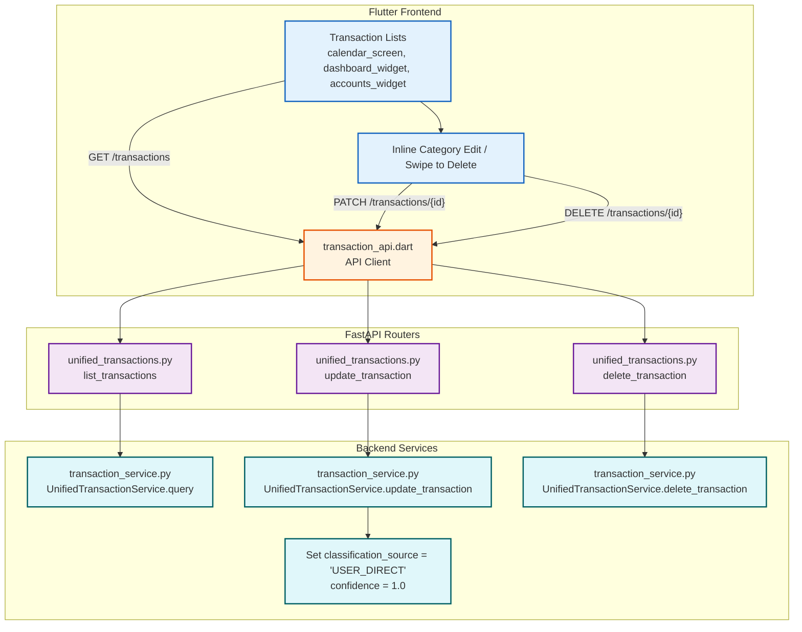

---

## 5. Account Management Flow

**Overview:** How bank accounts and credit cards are registered, linked to imported statements, merged when duplicates arise, and managed by the user.

#### Knowledge Graph Trace

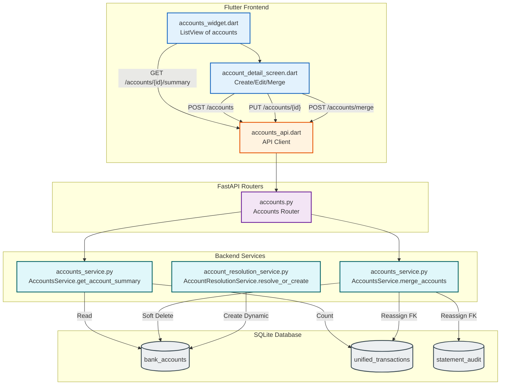

---

## 6. Investments Tracking Flow

**Overview:** How investment transactions (MF, Stocks, PPF) are detected and aggregated into a live portfolio dashboard with asset class breakdowns.

#### Knowledge Graph Trace

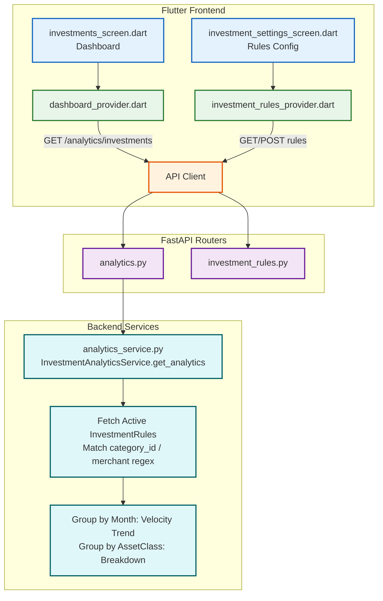

---

## 7. Dashboard & Analytics Flow

**Overview:** View financial summary, charts, and insights. Dashboard layout is customizable.

#### Knowledge Graph Trace

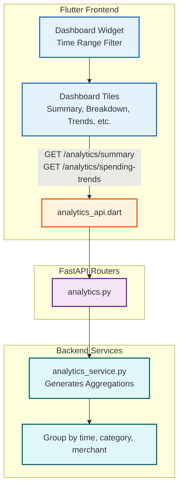

---

## 8. Category Management Flow

**Overview:** Create, edit, and configure auto-categorization keywords.

#### Knowledge Graph Trace

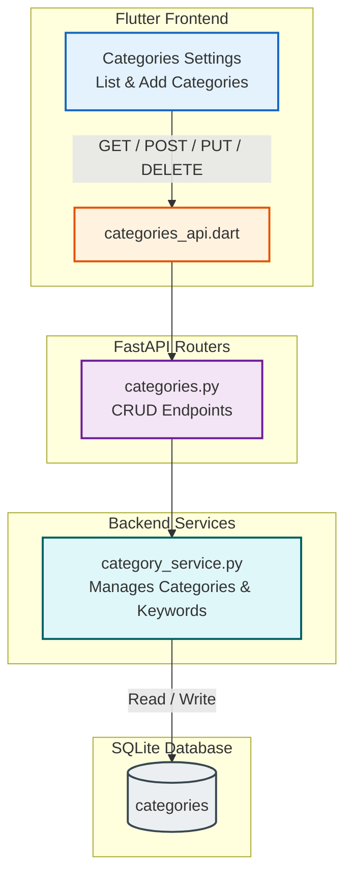

---

## 9. App Settings, GDrive Backup & Data Management Flow

**Overview:** System administration tasks, including Google Drive backups, CSV exports, and database resetting.

#### Knowledge Graph Trace

```mermaid
graph TD
    %% Frontend UI
    subgraph Frontend [Flutter Frontend]
        UI_Settings[settings_screen.dart]
        UI_DB[database_manager_screen.dart]
        
        API_Client[gdrive_api.dart]
        UI_Settings --> API_Client
        UI_DB --> API_Client
    end

    %% Backend Routers
    subgraph Routers [FastAPI Routers]
        Route_G[gdrive.py\nBackup endpoints]
        Route_Exp[export.py\nCSV/Clear-all]
        
        API_Client --> Route_G
        API_Client --> Route_Exp
    end

    %% Backend Services
    subgraph Services [Backend Services]
        Task_Backup[Create tar.gz\nUpload to GDrive via OAuth]
        Task_Export[Stream UnifiedTransaction rows as CSV]
        Task_Clear[db.query().delete() across core tables]
        
        Route_G --> Task_Backup
        Route_Exp --> Task_Export
        Route_Exp --> Task_Clear
    end

    %% Database
    subgraph DB [SQLite Database]
        DB_Bank[(bank_accounts)]
        DB_Tx[(unified_transactions)]
        DB_Audit[(statement_audit)]
        
        Task_Export -- "SELECT" --> DB_Tx
        Task_Clear -- "DELETE" --> DB_Bank
        Task_Clear -- "DELETE" --> DB_Tx
        Task_Clear -- "DELETE" --> DB_Audit
    end

    %% Styling
    classDef ui fill:#e3f2fd,stroke:#1565c0,stroke-width:2px;
    classDef api fill:#fff3e0,stroke:#e65100,stroke-width:2px;
    classDef router fill:#f3e5f5,stroke:#6a1b9a,stroke-width:2px;
    classDef service fill:#e0f7fa,stroke:#006064,stroke-width:2px;
    classDef db fill:#eceff1,stroke:#37474f,stroke-width:2px;

    class UI_Settings,UI_DB ui;
    class API_Client api;
    class Route_G,Route_Exp router;
    class Task_Backup,Task_Export,Task_Clear service;
    class DB_Bank,DB_Tx,DB_Audit db;
```

---

## 10. UPI ID Management Flow

**Overview:** Map UPI handles to accounts and categories for smarter categorization.

#### Knowledge Graph Trace

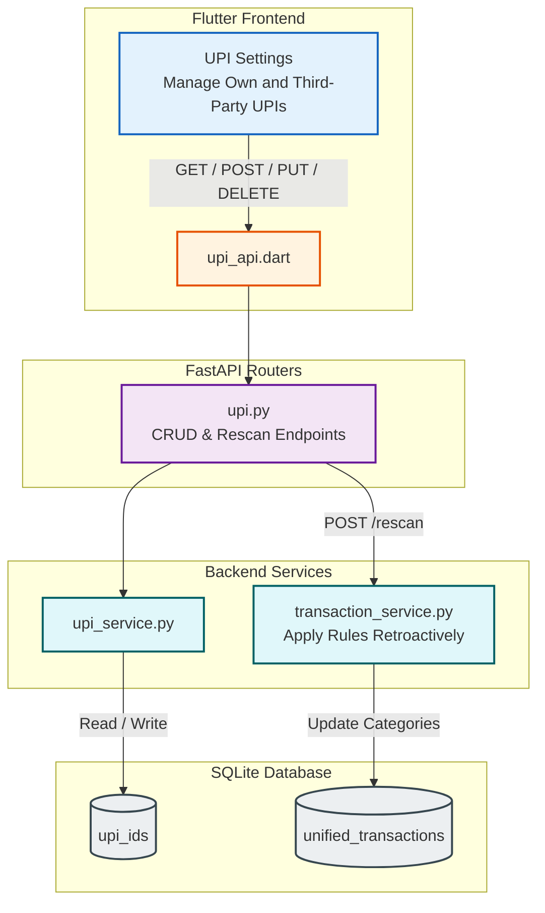

---

## 11. Local Directory Sync Flow

**Overview:** Scan and import bank statements from a local filesystem directory.

#### Knowledge Graph Trace

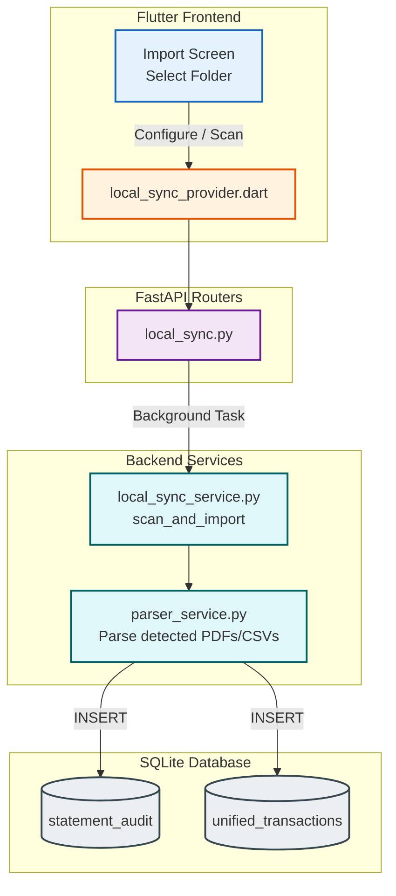

---

## 12. Admin / Database Manager Flow

**Overview:** Browse, search, and edit database tables through a generic admin interface.

#### Knowledge Graph Trace

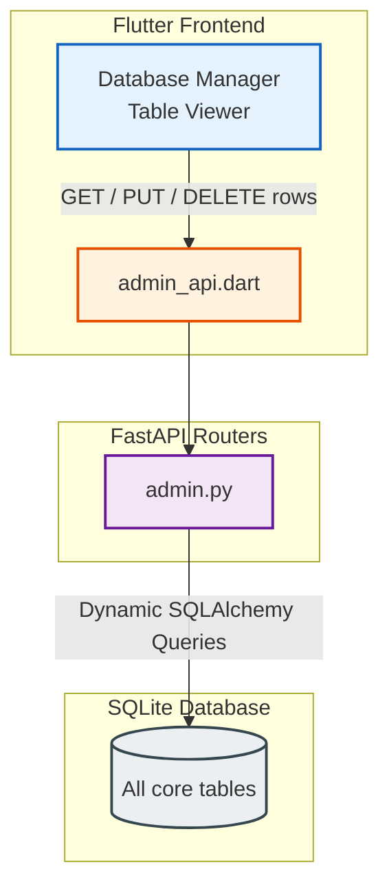

---

## API Summary

| Domain | Endpoints | Version |
|--------|:---------:|---------|
| Health | 1 | — |
| Upload (Unified) | 3+ | v2 |
| Categories | 7+ | v2 |
| Unified Transactions | 8 | v2 |
| Tags | 4 | v2 |
| Analytics | 7 | v2 |
| Accounts | 4 | v2 |
| Export/Data | 3 | v2 |
| Google Drive (OAuth) | 12 | v2 |
| UPI IDs | 7 | v2 |
| Local Directory Sync | 6 | v2 |
| Admin / Database | 7+ | v2 |
| Classification Rules | 5 | v2 |

> All v2 endpoints are prefixed with `/api/v2/`.
> The `/health` endpoint is public; all others operate directly on the backend.
> Interactive API docs available at `/docs` (Swagger UI) and `/redoc` (ReDoc) when the backend is running.
